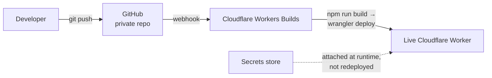
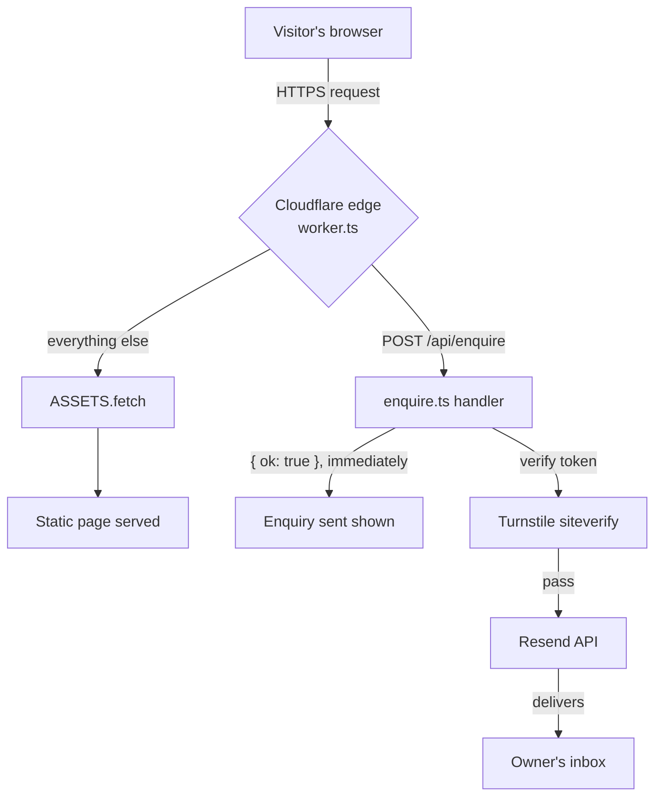

# Rental Direct-Booking Site

A production marketing and booking-enquiry website for a short-term rental property, taken from a static design handoff to a live, deployed site with a spam-protected enquiry pipeline — directed end-to-end through Claude Code. **Client name withheld by request**; the code and architecture here are the client's implementation with all property-specific content (copy, photos, contact details, testimonials) removed.

## What it does

A 4-page site — Home, The Space, Things to Do, Enquire — built to capture direct bookings away from Airbnb/Vrbo commission fees:

- An interactive date-range **booking widget** on the home page (calendar picker, guest counter), whose selection hands off to the Enquire page via `localStorage` + URL params, arriving pre-filled
- An **enquiry form** wired to a real backend: server-side validation, Cloudflare Turnstile spam protection, and email delivery via Resend — not a mailto: link or a third-party form embed
- Content structured as plain data files so a free git-based CMS (Decap/Sveltia) can sit on top later, letting a non-technical property owner edit copy, prices, and photos without touching code or paying for a hosted CMS

## Stack

- **Astro** — static site generation; ships zero JS by default, hydrating only the interactive booking widget
- **TypeScript** — the Worker and its handlers
- **Cloudflare Workers** — compute *and* static asset hosting in one deployable unit (see architecture below — this isn't classic Cloudflare Pages)
- **Cloudflare Turnstile** — spam-blocking on the enquiry form, no CAPTCHA UX tax on real visitors
- **Resend** — transactional email for enquiry notifications
- **GitHub + Cloudflare Workers Builds** — push to `main`, it builds and deploys automatically; no separate CI/CD service

## Architecture

**Deploy — fires once, on `git push`:**

**Serving a request — happens on every visit:**

The browser gets its confirmation immediately — the spam check and email send happen after, and never block what the visitor sees.

## Notable code

- [`src/worker.ts`](src/worker.ts) — the Worker's entry point; routes `/api/enquire`, falls through to static assets for everything else
- [`src/server/enquire.ts`](src/server/enquire.ts) — the enquiry handler: validation, Turnstile verification, Resend email composition
- [`src/components/BookingWidget.astro`](src/components/BookingWidget.astro) — the date-range calendar, guest counter, and cross-page state handoff
- [`src/components/PhotoSlot.astro`](src/components/PhotoSlot.astro) — renders a real photo when one exists, otherwise an honest "photo needed" placeholder naming the shot still missing, instead of a broken image or a stock substitute

## Key design decisions

**Matched infrastructure to actual scale.** No Kubernetes, no dedicated database, no separate CI service — the whole site is 4 static pages plus one small serverless function with no persistent state. Cloudflare Workers covers hosting, compute, and CI/CD in one platform; reaching for a heavier stack here would have added operational surface with nothing for it to do.

**Caught a real deployment-model mismatch.** The enquiry backend was first built as a Cloudflare Pages Function (`functions/api/*` file-based routing) — the wrong model for this project, which deploys via Cloudflare's newer Workers Builds flow (`wrangler deploy`), not classic Pages. Rebuilt it as a proper Worker with a static-assets binding, and verified the fix locally with `wrangler dev` (which runs the real deploy artifact) rather than trusting `astro dev` alone, which doesn't serve Worker routes at all.

**Verified photo content before publishing, not just labels.** Several of the original design handoff's image captions didn't match what was actually in the source photos (one labeled "en-suite shower" was actually the garden bar). Caught by opening and inspecting each image before wiring it in, rather than trusting existing metadata.

**Sequenced SEO deliberately.** Structured data and keyword-targeted metadata went in immediately since they carry no risk. Sitemap generation, canonical URLs, and search indexing were deliberately held back and the site marked `noindex` while it sat on a placeholder subdomain for client review — avoiding a duplicate-content problem for when the real production domain replaces it.

## Process

Directed end-to-end through Claude Code across the full lifecycle of a real client engagement: turning a static design-tool export into a production Astro codebase, making and justifying the architecture calls above, catching and fixing real bugs, sequencing infrastructure work in the right order, and walking a non-technical client through the account setup for the services the site depends on (GitHub, Cloudflare, Resend). The interesting parts weren't writing code — they were the judgment calls: what to build, what to verify before trusting it, and what to defer until the right moment.
